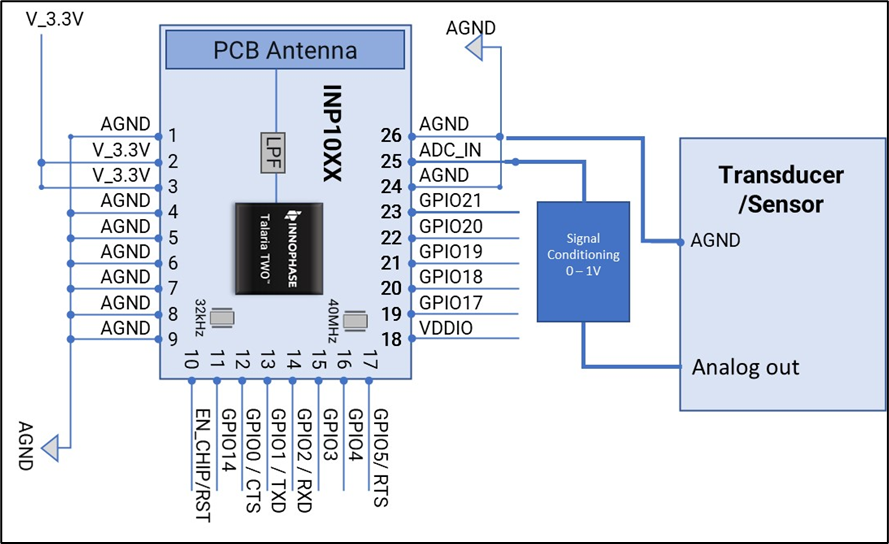
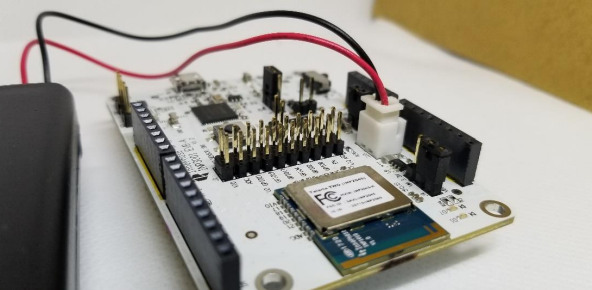
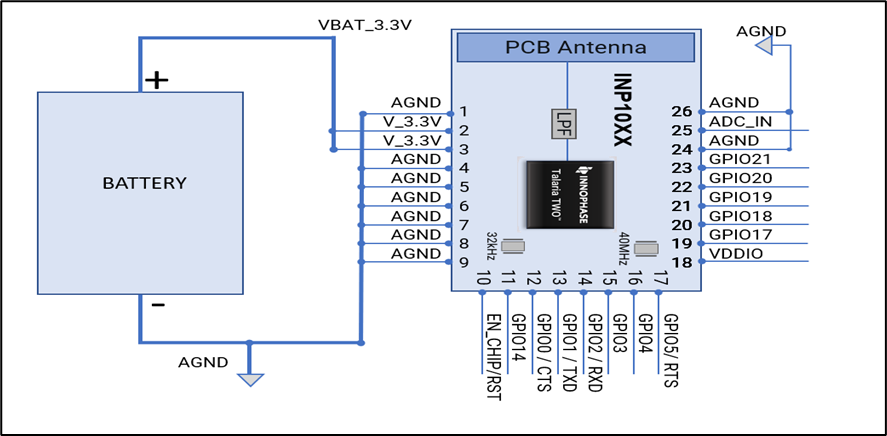

Talaria TWO\ :sup:`™`\ (INP2045)

Low Power Multi-Protocol Wireless Platform SoC

IEEE 802.11 b/g/n, BLE 5.0

Revision History

.. table:: Table 1: ADC Specifications

   +---------+------------+-----------------------------------------------+
   | **Ve    | **Date**   | **Comments**                                  |
   | rsion** |            |                                               |
   +=========+============+===============================================+
   | 1.0     | 07-23-2021 | First release.                                |
   +---------+------------+-----------------------------------------------+
   | 2.0     | 01-27-2022 | Updated for SDK 2.4 release.                  |
   +---------+------------+-----------------------------------------------+

Contents
========

`1 Figures <#figures>`__ `3 <#figures>`__

`2 Tables <#tables>`__ `3 <#tables>`__

`3 Terms & Definitions <#terms-definitions>`__
`3 <#terms-definitions>`__

`4 Overview <#overview>`__ `4 <#overview>`__

`5 Analog to Digital Converter
(ADC) <#analog-to-digital-converter-adc>`__
`4 <#analog-to-digital-converter-adc>`__

`5.1 ADC block diagram <#adc-block-diagram>`__
`4 <#adc-block-diagram>`__

`6 VBAT Voltage <#vbat-voltage>`__ `5 <#vbat-voltage>`__

`6.1 VBAT block diagram <#vbat-block-diagram>`__
`6 <#vbat-block-diagram>`__

`7 Source Code Walkthrough <#source-code-walkthrough>`__
`7 <#source-code-walkthrough>`__

`7.1 Application flow <#application-flow>`__ `7 <#application-flow>`__

`7.2 ADC APIs <#adc-apis>`__ `8 <#adc-apis>`__

`7.3 Source file <#source-file>`__ `9 <#source-file>`__

`7.3.1 adc.c <#adc.c>`__ `9 <#adc.c>`__

`8 Building <#building>`__ `10 <#building>`__

`9 Running the Application <#running-the-application>`__
`11 <#running-the-application>`__

`9.1 Programming Talaria TWO device using the Download
Tool <#programming-talaria-two-device-using-the-download-tool>`__
`11 <#programming-talaria-two-device-using-the-download-tool>`__

`9.2 Expected Output <#expected-output>`__ `12 <#expected-output>`__

`10 Support <#support>`__ `15 <#support>`__

`11 Disclaimers <#disclaimers>`__ `16 <#disclaimers>`__

Figures
=======

Figure 1: ADC - Block Diagram `4 <#_Toc94205630>`__

Figure 2: J10 Battery connection `5 <#_Toc94205631>`__

Figure 3: VBAT-Block Diagram `6 <#_Toc94205632>`__

Tables 
=======

Table 1: ADC Specifications `4 <#_Toc94205627>`__

Terms & Definitions 
====================

ADC Analog to Digital Converter

SAR Successive Approximation Register

Overview
========

This application note provides details on using the Analog to Digital
Converter (ADC) peripheral of Talaria TWO modules.

Analog to Digital Converter (ADC)
=================================

Talaria TWO modules have a 10-bit effective SAR ADC for measuring the
internal supply voltage and temperature levels in addition to measuring
an external voltage level through a specified ADC port.

+-----------------------------------+--------------+------------------+
| **ADC Specification**             | **Details**  | **Unit**         |
+===================================+==============+==================+
| ADC Input Channels                | VBAT, TEMP,  | --               |
|                                   | EXT          |                  |
+-----------------------------------+--------------+------------------+
| External Voltage Input Range      | 0 to 1.0     | V                |
+-----------------------------------+--------------+------------------+
| Additional Delay for ADC Ready    | 5            | μs               |
| after Wakeup                      |              |                  |
+-----------------------------------+--------------+------------------+

ADC block diagram
-----------------

Figure 1: ADC - Block Diagram

 VBAT Voltage
=============

VBat is the Voltage of the Battery. It could be used to power a
component that takes Battery Voltage.

Header J4 will switch between VBat and Vm_3.3V.

Figure 2: J10 Battery connection

When using a battery as a power source, there will be an additional
current drawn from LED (D7 or D12 depending on board version). If
attempting to measure an accurate module current drawn from the battery
connection, the LED series resistor must be removed to disconnect the
LED.

It configures the clocking and power profile of the block to match the
current source and optimize energy consumption. When the device is
powered through the VBAT Domain most of the circuits are powered down to
conserve energy.

Based on the mode, The power for module is derived from either USB or
shield header. A battery header is available which can be used as power
source as well.

a. J4 at VM_3.3V for USB power

b. J4 at VBAT and battery connect to J10 for Battery power

   1. .. rubric::  VBAT block diagram
         :name: vbat-block-diagram

Figure 3: VBAT-Block Diagram

7. .. rubric:: Source Code Walkthrough
      :name: source-code-walkthrough

   1. .. rubric:: Application flow
         :name: application-flow

The application displays the raw value that varies according to the
input provided to the ADC pin. Apart from the raw value measured out of
the ADC pin, the internal temperature in integer Celsius and the VBAT in
mv measured from source are also displayed.

This sample application:

1. Reads the internal temperature and prints the value

2. Reads the external ADC input and prints the value

3. Prints the internal temperature in integer Celsius

   1. .. rubric:: ADC APIs
         :name: adc-apis

1. os_vbat()- Reads VBAT voltage

..

   This API is used to enable the VBAT mode. A back-up source must be
   connected to VBAT pin. The voltage value (in millivolt) on the VBAT
   pin is returned.

2. os_adc()- Reads external ADC input

..

   Displays the raw value to the input provided to the ADC pin.

3. os_core_temp() – Reads internal temperature

..

   The inner temperature (in integer Celsius) of the chip core is
   displayed.

1. .. rubric:: Source file
      :name: source-file

   1. .. rubric:: adc.c
         :name: adc.c

Following is the example code which displays the ADC raw value for an
external input voltage fed through the the ADC pin, VBAT and internal
temperature of Talaria TWO.

1. os_adc()converts the analog input at the ADC pin and prints raw data
   as an output.

2. os_vbat()prints the VBAT voltage in millivolt from the back-up source
   on the VBAT pin

3. os_core_temp()reads the internal temperature and prints the
   temperature in internal Celsius type.

+-----------------------------------------------------------------------+
| os_msleep(1000);                                                      |
|                                                                       |
| os_printf("ADC External value: %d\\n",os_adc());                      |
|                                                                       |
| os_printf("V_BAT: %d mv\\n",os_vbat());                               |
|                                                                       |
| os_printf("Internal Temperature: %d Celsius\\n",os_core_temp());      |
+=======================================================================+
+-----------------------------------------------------------------------+

Building
========

To build the sample application, execute the following commands from SDK
directory:

+-----------------------------------------------------------------------+
| cd examples/adc                                                       |
|                                                                       |
| make                                                                  |
+=======================================================================+
+-----------------------------------------------------------------------+

The make command should generate the adc.elf in the out directory.

9. .. rubric:: Running the Application
      :name: running-the-application

   1. .. rubric:: Programming Talaria TWO device using the Download Tool
         :name: programming-talaria-two-device-using-the-download-tool

Program adc.elf (sdk_x.y\\examples\\adc\\bin) using the Download tool:

1. Launch the Download tool provided with InnoPhase Talaria TWO SDK.

2. In the GUI window:

   a. Boot Target: Select the appropriate EVK from the drop-down.

   b. ELF Input: Load the adc.elf by clicking on Select ELF File.

   c. Programming: Click on Prog Flash.

For more details on using the Download tool, refer to the document:
UG_Download_Tool.pdf (path: *sdk_x.y/pc_tools/Download_Tool/doc*).

**Note**: x and y refer to the SDK release version. For example:
sdk_2.4/doc.

Expected Output
---------------

On flashing the application using the Download Tool, the console output
is as follows:

+-----------------------------------------------------------------------+
| UART:NWWWWAE                                                          |
|                                                                       |
| Build $Id: git-b664be2af $                                            |
|                                                                       |
| hio.baudrate=115200                                                   |
|                                                                       |
| flash: Gordon ready!                                                  |
|                                                                       |
| UART:NWWWAEBuild $Id: git-b664be2af $                                 |
|                                                                       |
| ADC Example                                                           |
|                                                                       |
| ADC External value:0                                                  |
|                                                                       |
| V_BAT:3253 mv                                                         |
|                                                                       |
| Internal Temperature:28 Celsius                                       |
|                                                                       |
| ADC External value:82                                                 |
|                                                                       |
| V_BAT:3252 mv                                                         |
|                                                                       |
| Internal Temperature:28 Celsius                                       |
|                                                                       |
| ADC External value:45                                                 |
|                                                                       |
| V_BAT:3252 mv                                                         |
|                                                                       |
| Internal Temperature:28 Celsius                                       |
|                                                                       |
| ADC External value:73                                                 |
|                                                                       |
| V_BAT:3253 mv                                                         |
|                                                                       |
| Internal Temperature:28 Celsius                                       |
|                                                                       |
| ADC External value:72                                                 |
|                                                                       |
| V_BAT:3252 mv                                                         |
|                                                                       |
| Internal Temperature:27 Celsius                                       |
|                                                                       |
| ADC External value:44                                                 |
|                                                                       |
| V_BAT:3252 mv                                                         |
|                                                                       |
| Internal Temperature:28 Celsius                                       |
|                                                                       |
| ADC External value:73                                                 |
|                                                                       |
| V_BAT:3253 mv                                                         |
|                                                                       |
| Internal Temperature:28 Celsius                                       |
|                                                                       |
| ADC External value:72                                                 |
|                                                                       |
| V_BAT:3252 mv                                                         |
|                                                                       |
| Internal Temperature:28 Celsius                                       |
|                                                                       |
| ADC External value:73                                                 |
|                                                                       |
| V_BAT:3252 mv                                                         |
|                                                                       |
| Internal Temperature:27 Celsius                                       |
|                                                                       |
| ADC External value:45                                                 |
|                                                                       |
| V_BAT:3253 mv                                                         |
|                                                                       |
| Internal Temperature:28 Celsius                                       |
|                                                                       |
| ADC External value:72                                                 |
|                                                                       |
| V_BAT:3253 mv                                                         |
|                                                                       |
| Internal Temperature:28 Celsius                                       |
|                                                                       |
| ADC External value:80                                                 |
|                                                                       |
| V_BAT:3252 mv                                                         |
|                                                                       |
| Internal Temperature:28 Celsius                                       |
|                                                                       |
| ADC External value:72                                                 |
|                                                                       |
| V_BAT:3253 mv                                                         |
|                                                                       |
| Internal Temperature:27 Celsius                                       |
|                                                                       |
| ADC External value:73                                                 |
|                                                                       |
| V_BAT:3252 mv                                                         |
|                                                                       |
| Internal Temperature:28 Celsius                                       |
|                                                                       |
| ADC External value:72                                                 |
|                                                                       |
| V_BAT:3253 mv                                                         |
|                                                                       |
| Internal Temperature:28 Celsius                                       |
|                                                                       |
| ADC External value:45                                                 |
|                                                                       |
| V_BAT:3252 mv                                                         |
|                                                                       |
| Internal Temperature:28 Celsius                                       |
|                                                                       |
| ADC External value:73                                                 |
|                                                                       |
| V_BAT:3253 mv                                                         |
|                                                                       |
| Internal Temperature:28 Celsius                                       |
|                                                                       |
| ADC External value:72                                                 |
|                                                                       |
| V_BAT:3251 mv                                                         |
+=======================================================================+
+-----------------------------------------------------------------------+

Support
=======

1. Sales Support: Contact an InnoPhase sales representative via email –
   sales@innophaseiot.com

2. Technical Support:

   a. Visit: https://innophaseiot.com/contact/

   b. Also Visit: https://innophaseiot.com/talaria-two-modules

   c. Contact: support@innophaseiot.com

InnoPhase is working diligently to provide outstanding support to all
customers.

Disclaimers
===========

Limited warranty and liability — Information in this document is
believed to be accurate and reliable. However, InnoPhase IoT
Incorporated does not give any representations or warranties, expressed
or implied, as to the accuracy or completeness of such information and
assumes no liability associated with the use of such information.
InnoPhase IoT Incorporated takes no responsibility for the content in
this document if provided by an information source outside of InnoPhase
IoT Incorporated.

InnoPhase IoT Incorporated disclaims liability for any indirect,
incidental, punitive, special or consequential damages associated with
the use of this document, applications and any products associated with
information in this document, whether or not such damages are based on
tort (including negligence), warranty, including warranty of
merchantability, warranty of fitness for a particular purpose, breach of
contract or any other legal theory. Further, InnoPhase IoT Incorporated
accepts no liability and makes no warranty, express or implied, for any
assistance given with respect to any applications described herein or
customer product design, or the application or use by any customer’s
third-party customer(s).

Notwithstanding any damages that a customer might incur for any reason
whatsoever, InnoPhase IoT Incorporated’ aggregate and cumulative
liability for the products described herein shall be limited in
accordance with the Terms and Conditions of identified in the commercial
sale documentation for such InnoPhase IoT Incorporated products.

Right to make changes — InnoPhase IoT Incorporated reserves the right to
make changes to information published in this document, including,
without limitation, changes to any specifications and product
descriptions, at any time and without notice. This document supersedes
and replaces all information supplied prior to the publication hereof.

Suitability for use — InnoPhase IoT Incorporated products are not
designed, authorized or warranted to be suitable for use in life
support, life-critical or safety-critical systems or equipment, nor in
applications where failure or malfunction of an InnoPhase IoT
Incorporated product can reasonably be expected to result in personal
injury, death or severe property or environmental damage. InnoPhase IoT
Incorporated and its suppliers accept no liability for inclusion and/or
use of InnoPhase IoT Incorporated products in such equipment or
applications and such inclusion and/or use is at the customer’s own
risk.

All trademarks, trade names and registered trademarks mentioned in this
document are property of their respective owners and are hereby
acknowledged.
